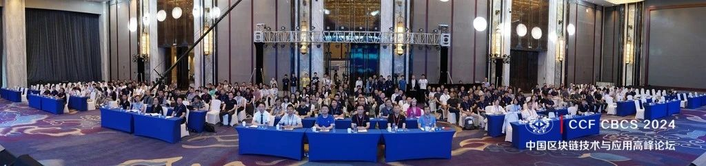
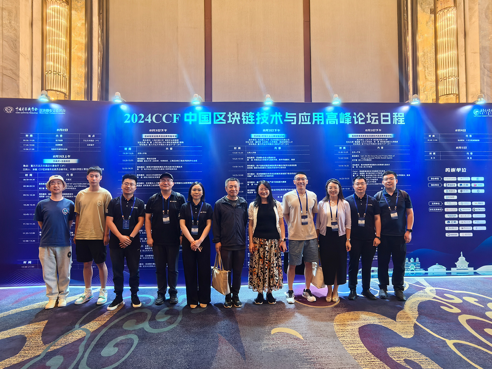
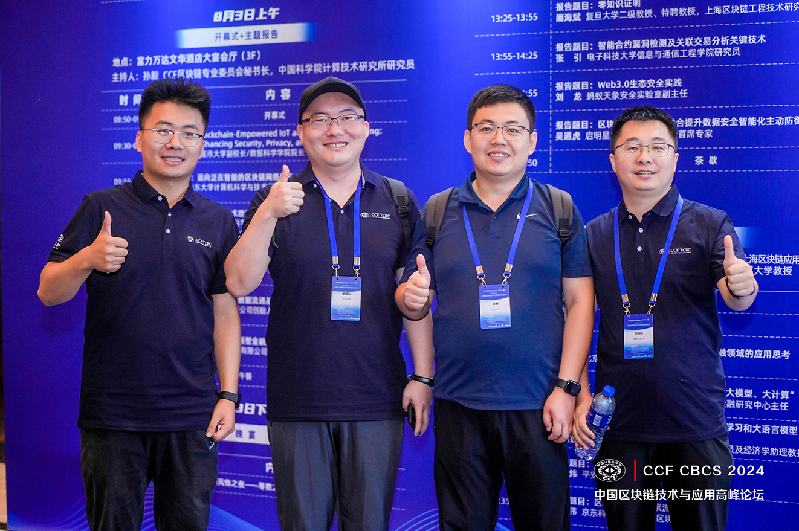

8月3日，由中国计算机学会（CCF）主办，内蒙古工业大学和CCF区块链专业委员会承办的2024CCF中国区块链技术与应用高峰论坛在呼和浩特市成功举行。我校党委副书记、校长郭喜，工信部信息技术发展司副司长江明涛，上海交通大学教授、CCF区块链专业委员会荣誉主任斯雪明，北京理工大学教授、CCF区块链专业委员会主任祝烈煌出席开幕式并致辞。大会组织委员会主席、中国科学院计算技术研究所研究员孙毅教授主持开幕式。我校党委委员、副校长刘利强和400余位来自全国各高校、科研院所和产业界专家学者、企业精英参加论坛。
 

 

 

