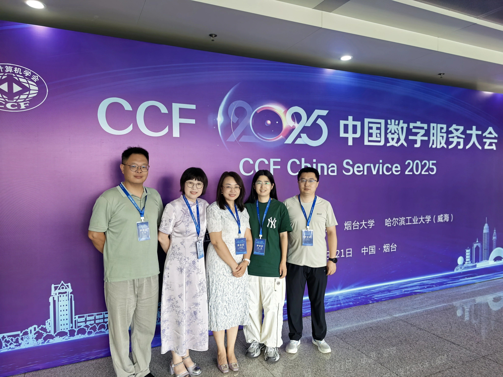
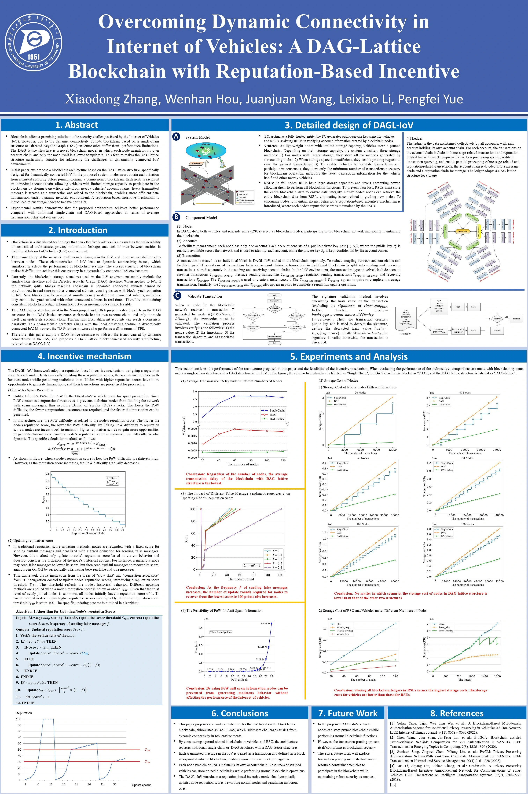

8月19日至21日，由中国计算机学会（CCF）主办，CCF服务计算专业委员会、烟台大学、哈尔滨工业大学（威海）联合承办的CCF 2025中国数字服务大会在烟台大学举行。中国工程院院士何友，CCF会士、中国工程院院士赵春江，中国科学院外籍院士、新加坡科学院院士黄铭钧，美国医学与生物工程院院士潘毅，俄罗斯科学院院士、CCF会士、哈尔滨工业大学首席教授Igor Sheremet，墨尔本大学杰出教授Rajkumar Buyya，山东大学学术委员会副主任、讲席教授、国家级人才教学名师、控制科学与工程学院院长张承慧，浙江大学求是特聘教授、软件学院院长尹建伟，武汉大学学术委员会信息学部委员会副主任李兵，吉利汽车研究院人工智能中心主任陈勇，字节跳动Code AI高级技术专家刘杰等国内外顶尖专家以及来自全国高校、科研院所、知名企业的1000余名行业代表齐聚一堂，围绕“数智服务：重塑产业体系，赋能社会治理”主题进行深入探讨。在会上，以海报的形式分享了学术成果“Overcoming Dynamic Connectivity in Internet of Vehicles：A DAG Lattice Blockchain with Reputation-Based Incentive”。
 
 

 
 

