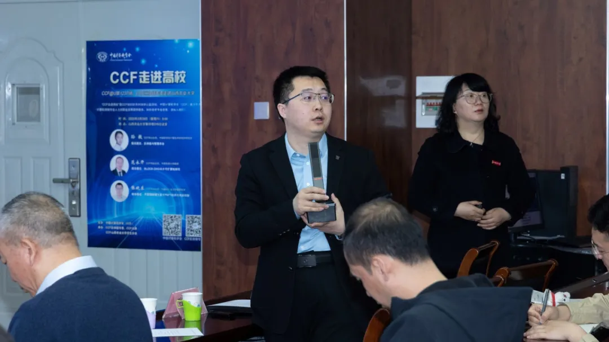
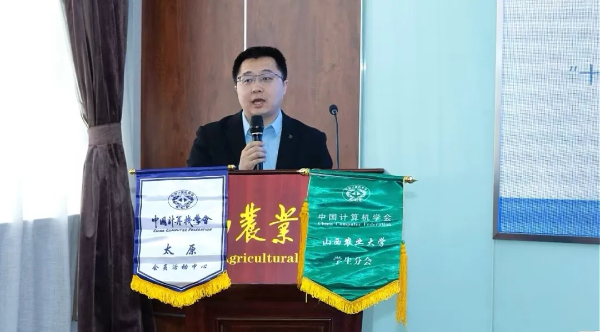

为助力学院人才培养和学科建设，提升师生对区块链的理解与应用，3月29日，山西农业大学软件学院于勤学楼316会议室举办“CCF走进高校”活动。会议特邀CCF太原会员活动主席赵鹏主持，CCF杰出会员、中国科学院计算技术研究所研究员孙毅，CCF高级会员、中国传媒大学教授范永开，CCF专业会员、内蒙古工业大学副研究员张晓东，软件学院副院长成丽君出席活动，软件学院师生代表到场参加。
 
 

 
 

 
 

