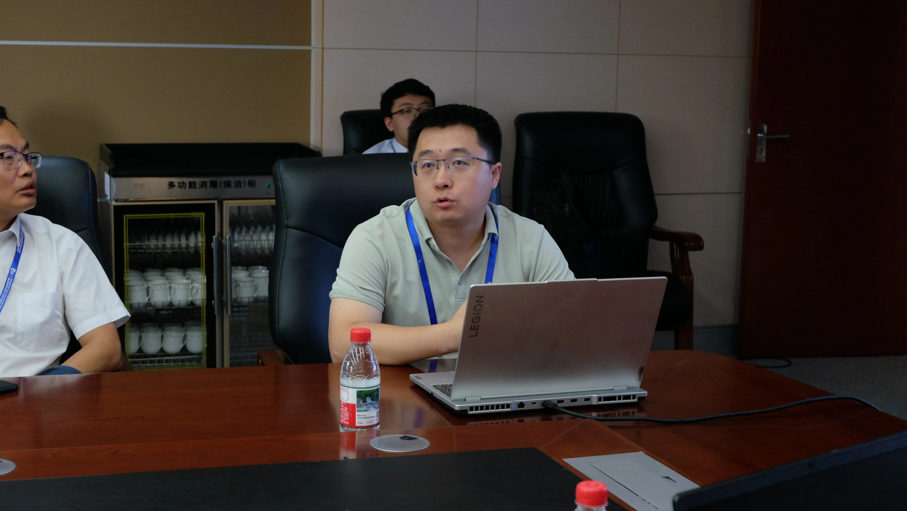
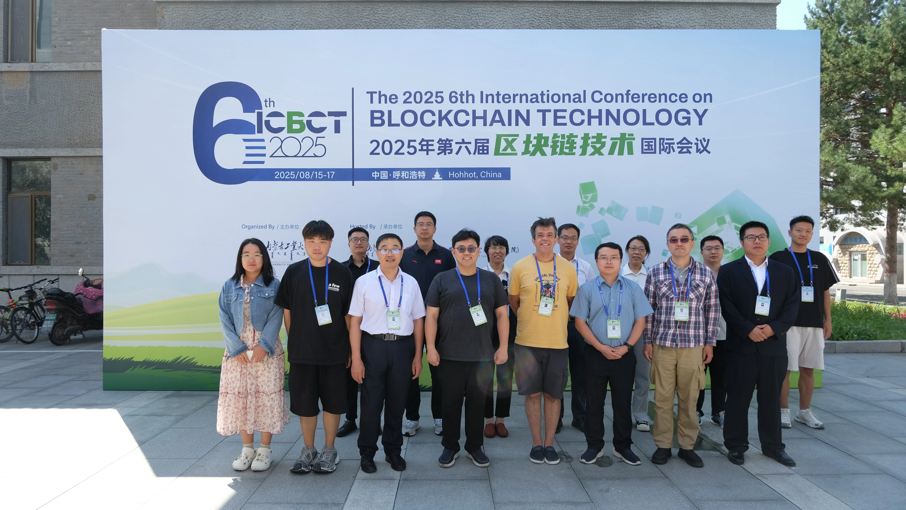

2025年8月15日至16日，由内蒙古工业大学承办的“第六届区块链技术会议”（ICBCT 2025）在新城校区举办。中国计算机学会区块链专委会秘书长孙毅研究员，国际专家全光吉教授等出席开幕式。来自国际国内区块链研究及应用领域的30余位专家、学者齐聚我校，分享区块链安全、区块链应用、区块链发展等方向最新研究成果。在16日下午的分会场，张晓东副研究员和学生王育麒分别对对学术论文“A Survey on Consensus Mechanism in Internet of Vehicles”和“An Overview of Sharding Technology in Blockchain”进行了报告。
 
 

 
 

