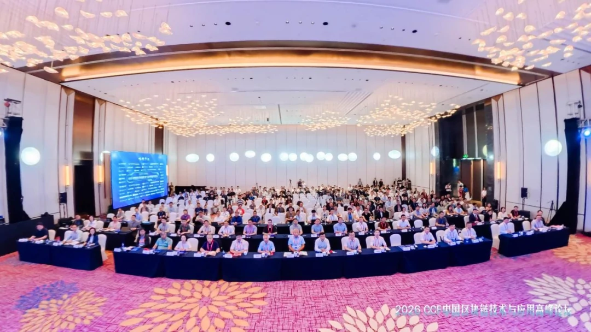
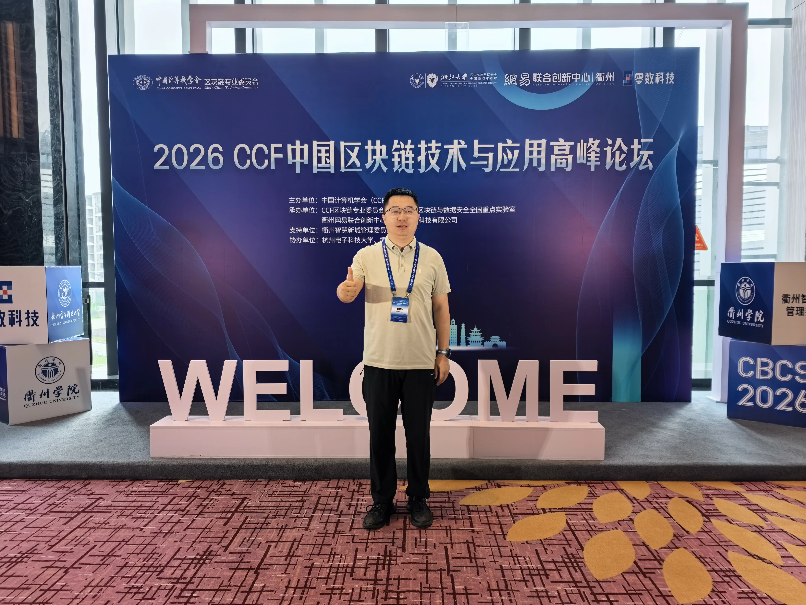

5月22日-24日，2026CCF中国区块链技术与应用高峰论坛于浙江衢州成功举办。大会由中国计算机学会（CCF）主办，CCF区块链专业委员会、浙江大学区块链与数据安全全国重点实验室、衢州网易联合创新中心、上海零数科技有限公司联合承办，衢州智慧新城管理委员会提供支持，杭州电子科技大学、衢州学院协办。本次高峰论坛立足产业实践、深耕区域特色，紧扣“区块链+AI”融合创新、底层核心技术突破、绿色低碳发展、数据要素流通等国家战略前沿热点，汇聚海内外顶尖院士专家、领军企业代表与资深科研人士共襄盛举，全面呈现区块链在赋能实体经济、优化数字治理及提升产业链韧性方面的先行示范经验。
 
 

 
 

